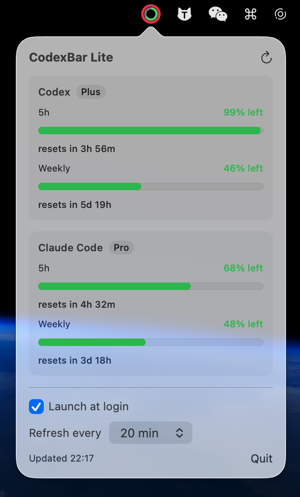

# CodexBar Lite

A tiny macOS menu-bar app that watches **two** subscriptions and nothing else:

- **Codex** (ChatGPT / `codex` CLI)
- **Claude Code** (`claude` CLI)

For each it shows the **5-hour** limit and the **weekly** limit — how much is left
and when each resets — on a single menu page, and notifies you when a limit is
**reached** and again when it **resets**.

No accounts to configure, no other providers, no dashboards, no cost tracking.
It reads the credentials the `codex` and `claude` CLIs already store on your Mac.

> This is a from-scratch slim rewrite. The original, full-featured CodexBar lives
> untouched in the `CodexBar/` subfolder and is used only as reference.



## Build & install

```sh
make install        # builds CodexBarLite.app and copies it to /Applications
```

Then launch **CodexBar Lite** from Spotlight/Finder. It appears as a ring icon in
the menu bar (no Dock icon). Other targets:

```sh
make app            # build CodexBarLite.app in the project root (no install)
make run            # run from the terminal (no bundle; notifications/login item won't work)
make build          # debug build only
make clean
```

Requires macOS 14+ and the Swift toolchain (Xcode or Command Line Tools).

## Using it

- **Menu-bar icon** — a ring filled to the *most constrained* of the four windows
  (Codex 5h/weekly, Claude 5h/weekly). Click it to open the page.
- **The page** — one card per sub: a bar + "% left" + "resets in …" for each of
  the 5h and weekly windows. Green / orange / red as you get closer to the limit.
- **Refresh** — automatic every 5 minutes and whenever you open the page; the ↻
  button forces it.
- **Launch at login** — toggle in the footer (needs the installed `.app`).
- **Notifications** — "limit reached" the moment a window hits its cap, and a
  punctual "limit reset" reminder scheduled for when it rolls over.

## How it reads usage

| | Source | Endpoint |
|---|---|---|
| Codex | `~/.codex/auth.json` (OAuth token; auto-refreshed & written back like the `codex` CLI) | `chatgpt.com/backend-api/wham/usage` |
| Claude Code | Keychain item `Claude Code-credentials`, else `~/.claude/.credentials.json` | `api.anthropic.com/api/oauth/usage` |

Both tokens **auto-refresh** when they expire. On refresh, the rotated token is
written back to the same store it was read from (so the app and the `claude` /
`codex` CLIs stay in sync on one source of truth — the only safe way to rotate
refresh tokens). For Claude, only the access token, refresh token, and expiry are
touched; every other field is preserved, and nothing is written if the existing
credential can't be read first.

## First-run note (Claude + Keychain)

The first time the app reads Claude's token you'll get a macOS prompt:
*"CodexBar Lite wants to use … Claude Code-credentials."* Click **Always Allow**.
You may get a second, similar prompt the first time it **refreshes** an expired
Claude token (it writes the new token back) — allow that once too. Because the app
is ad-hoc signed, rebuilding it changes its identity and macOS may ask again after
a rebuild — just allow it once more.

If a card says *"Not logged in"* or *"Token expired"*, run `codex` / `claude` in a
terminal to refresh that CLI's login.
